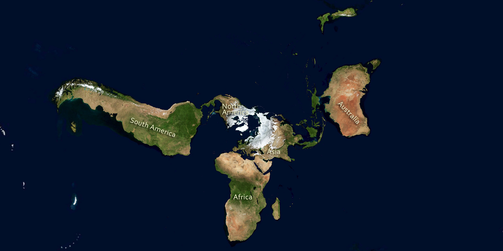
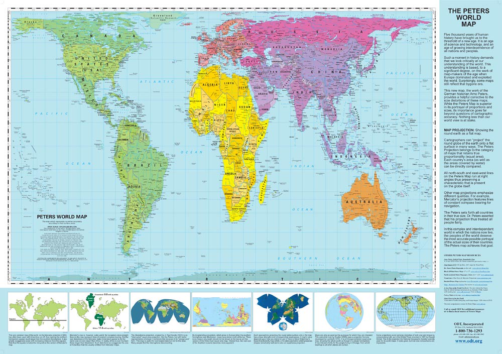
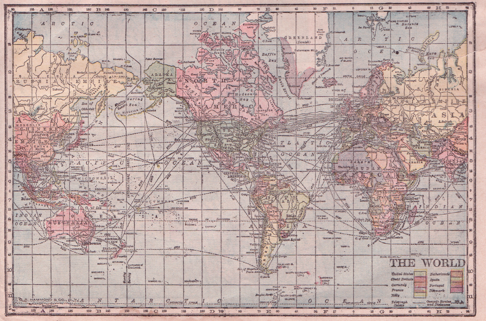

# Introduction {-}

This toolkit provides an **introduction to GIS and spatial analysis** for opioid environment applications that will allow researchers, analysts, and practitioners to support their communities with better data analytics and visualization services. 

We introduce basic spatial analytic functionalities using **open source tools**, mainly in R, using applied examples for visualizing, mapping, and understanding the opioid risk environment. 

## Software Basics {-}

We assume a basic knowledge of R and coding languages for these toolkits. For most of the tutorials in this toolkit, you’ll need to have R and RStudio downloaded and installed on your system. You should be able to install packages, know how to find the address to a folder on your computer system, and have very basic familiarity with R. If you are new to R, we recommend the following <a href="https://learn.datacamp.com/courses/free-introduction-to-r">intro-level tutorials</a> provided through <a href="https://rspatial.org/intr/1-introduction.html">installation guides</a>. You can also refer to this <a href="https://datacarpentry.org/r-socialsci/">R for Social Scientists</a> tutorial developed by Data Carpentry for a refresher.

We will work with following libraries, so please be sure to install: 

* sf 
* tmap
* tidyverse
* tidycensus

There are differing spatial ecosystems in R. We use the `sf` ecosystem that is compatible with the `tidyverse`. If you need to work between these two R spatial ecosystems, see [this guide](https://github.com/r-spatial/sf/wiki/Migrating) for a translation of `sp` to `sf` commands.    

## Author Team {-}

This toolkit was developed for the [JCOIN network](https://heal.nih.gov/research/research-to-practice/jcoin) by Marynia Kolak, Moksha Menghaney, Qinyun Lin, and Angela Li at the <a href="https://spatial.uchicago.edu/">Center for Spatial Data Science</a> at the University of Chicago as part of the Methodology and Advanced Analytics Resource Center (MAARC). 

JCOIN is part of the of the NIH HEAL Initiative. The Helping to End Addiction Long-term Initiative<sup>SM</sup>, or NIH HEAL Initiative<sup>SM</sup>, supports a wide range of programs to develop new or improved prevention and treatment strategies for opioid addiction.

***

```{r, echo=F}
knitr::include_graphics('img/JCOIN-logo-web.jpg')
```


```{r setup, include=FALSE}
knitr::opts_chunk$set(echo = TRUE)
options(tigris_use_cache = TRUE)
```

<!--chapter:end:index.Rmd-->

# Spatial Data Introduction

## Defining spatial data  {#SD-spatial-data}
Spatial data refers to data that contain information about specific locations, and the information content of the data may change with location. In other words, "information" and "location" are two important elements in spatial data. On some occasions, spatial data may only include "location." But without "location," the data is no longer spatial anymore. For example, a spatial data that describes the resource distribution of Medications for Opioid Overuse Disorder (MOUDs) must contain *and enable* location information of these MOUD resources, otherwise the data becomes a non-spatial list of those resources.

For the purpose of this tutorial, we will only briefly introduce some important concepts in spatial data. See *Further Resources* if you would like to learn more about these concepts. 

## Spatial data formats {#SD-vector-data}
Spatial data can be stored in a text file like comma-separated value (CSV) files. However, the text file needs to have essential location columns with latitude and longitude to represent the coordinate location of a spatial object. Furthermore, a CSV file with lat/long columns is only a flat/non-spatial file, until the spatial location context is enabled as a new spatial data format.

A common spatial data format is the shapefile, which comes from ESRI/ArcGIS proprietary software. The shapefile file format (.shp for short) includes a minimum of 4 files, with a common prefix and different filename extensions `.shp`, `.shx`, `.dbf`, and `.prj`. In order to work with the spatial data, we need all these four components of the shapefile stored in the same directory, so that the software (such as R) can know how to project spatial objects onto a geographic or coordinate space (i.e., spatial location context is enabled). Other common spatial data formats include the GeoJSON, KML, and geopackage.

### Simple features

[Simple features](https://r-spatial.github.io/sf/articles/sf1.html) refers to an international standard (ISO 19125-1:2004) that describes how real-world objects, and their spatial geometries, are represented in computers. This standard is enabled in ESRI/ArcGIS architecture, POSTGIS (a spatial extension for PostGresSQL), the GDAL libraries that serve as underpinnings to most GIS work, and GeoJSONs. The `sf` R ecoystem makes simple features even more accessible within R, so that simple feature objects in spatial data are also stored in a data frame, with one vector/column containing geographic data (usually named "geometry" or "geom"). 

Why should you care about these computational components of spatial systems architecture? Spatial analysis often requires troubleshooting, and spatial formats can be complicated. 

We recommend using the `str` function in R to familiarize yourself with data objects as you go, and to explore the data files as well. For example: a `shapefile` includes (at least) four components, separating the data as a `.dbf` file and projection information as a `.prj` file. In contrast, the `sf` spatial file loaded in your R environment is one unified object, has the spatial information recorded as a geometry field, and projection stored as metadata. 

## Spatial data types

Two common formats of spatial data are vector and raster data. Vector data represents the world surface using **points, lines, and polygons** whereas raster data can be satellite imagery or other pixelated surface. We focus on vector data in this toolkit. A group of clinics can be geocoded and converted to points, whereas zip code boudnaries are represented as polygons. Note that spatial data types include the basic attributes *in addition to* their spatial information. So  point locations on a map correspond to the details fo each clinic provider, etc.

Read more regarding vector and raster data from [Chapter 2 Geographic data in R](https://geocompr.robinlovelace.net/spatial-class.html#intro-sf) of the Lovelace et al 2019 text, [Geocomputation with R](https://geocompr.robinlovelace.net/). This opensource text is an incredible resource for those who are interested in learning more details regarding geographic data analysis, visualization, and modeling, and represents one of dozens of resources available for learning and honing R & spatial analysis skills.

## Coordinate Reference System {#SD-crs}
As noted before, the most fundamental element of a spatial data is "location." A **Coordinate Reference System (CRS)** communicates what method should be used to flatten or project the Earth's surface onto a 2-dimensional map.

Importantly, different CRS implies different ways of projections and generates substantially different visualizations. For example, following are some world maps using different projections. (Check out [here](https://futuremaps.com/blogs/news/top-10-world-map-projections) for more different world map projections.)

```{r, echo=F, fig.cap="[The whole wide world](https://www.flickr.com/photos/34197995@N02/9514590409) by [PeterFisken](https://www.flickr.com/photos/34197995@N02) is under [CC BY 2.0](https://creativecommons.org/licenses/by/2.0/?ref=ccsearch&atype=rich)"}

```
```{r, echo=F, fig.align = 'center', fig.cap="[Peters Projection World Map (35'x51')](https://www.flickr.com/photos/35468141938@N01/3714559813) by [inju](https://www.flickr.com/photos/35468141938@N01) is under [CC BY-NC-SA 2.0](https://creativecommons.org/licenses/by-nc-sa/2.0/?ref=ccsearch&atype=rich)"}

```
```{r, echo=F, fig.cap="[Hammond Cylindrical Projection World Map 1905](https://www.flickr.com/photos/14277117@N03/4775662240) by [perpetualplum](https://www.flickr.com/photos/14277117@N03) is licensed under [CC BY 2.0](https://creativecommons.org/licenses/by/2.0/?ref=ccsearch&atype=rich)"}

```

Because different CRS imply different ways of projections and generates substantially different visualizations, it is important to make sure the CRS accompanied with each spatial data are the same before implementing any advanced spatial analysis or geometric processing. In `sf`, you can use the function `st_crs` to check the CRS used in one data, and the function `st_transform` to project the data to a particular CRS. See this [Interactive Tutorial](https://spatialanalysis.github.io/workshop-notes/introduction-to-spatial-data.html#interactive-tutorial) that demonstrates these functions.  

The CRS concept can be tricky to comprehend and utilize in practice, so we will come back to this several times in our tutorials. 

## Further resources {-#SD-appendix}
* See [Chapter 2 Geographic data in R in Geocomputation with R](https://geocompr.robinlovelace.net/spatial-class.html) for more info about [Vector data](https://geocompr.robinlovelace.net/spatial-class.html#vector-data), [Raster data](https://geocompr.robinlovelace.net/spatial-class.html#raster-data), and [Coordiante Reference Systems](https://geocompr.robinlovelace.net/spatial-class.html#raster-data). 
* See this [Software Carpentry workshop](https://datacarpentry.org/organization-geospatial/03-crs/index.html) for more explanations to better understand coordinate reference systems. 
* See this [Interactive Tutorial](https://spatialanalysis.github.io/workshop-notes/introduction-to-spatial-data.html#interactive-tutorial) that uses `sf` package to project spatial data in R.  


<!--chapter:end:spatial-data-introduction.Rmd-->

# Geocoding Resource Locations {#geocode-points}

## Overview{#GA-research-question}

A common goal in opioid environment research is to calculate and compare access metrics to different providers of Medications for Opioid Overuse Disorder (MOUDs). Before we can run any analytics on the resource location data, we need to convert resource addresses to spatial data points, which can be then used to calculate access metrics. 

**Geocoding** is the process of converting addresses (like a street address) into geographic coordinates using a known coordinate reference system. We can then use these coordinates (latitude, longitude) to spatially enable our data. This means we convert to a spatial data frame (sf) within R for spatial analysis within our R session, and then save as a shapefile (a spatial data format) for future use. In this tutorial we demonstrate how to geocode resource location addresses and convert to spatial data points that can be used for future mapping and geospatial analysis. 

Our objectives are thus to:

* Geocode addresses to get geographic coordinates
* Visualize the resource locations as points on a map in R
* Transform a flat file (.CSV) to a spatially enabled shapefile (.SHP)

## Environment Setup {#GA-setup}
To replicate the code & functions illustrated in this tutorial, you’ll need to have R and RStudio downloaded and installed on your system. This tutorial assumes some familiarity with the R programming language.

### Input/Output {#GA-i-o}
Our input will be a **CSV** file that include addresses of our resources. This files can be found [here](https://github.com/GeoDaCenter/opioid-environment-toolkit/tree/master/data).

* Chicago Methadone Clinics, `chicago_methadone.csv`

We will convert these addresses to geographic coordinates using an appropriate coordinate reference system (CRS), and then spatially enable the data for mapping. We will then export the spatial dataframe as a **shapefile**.

### Load Libraries {#GA-packages1}
We will use the following packages in this tutorial:
  
- `sf`: to manipulate spatial data
- `tmap`: to visualize and create maps
- `tidygeocoder`: to convert addresses to geographic coordinates

Then load the libraries for use. *Note:* The messages you see about GEOS, GDAL, and PROJ refer to software libraries that allow you to work with spatial data.

```{r warning = FALSE, messages=FALSE}
library(sf)
library(tidygeocoder)
library(tmap)
```

### Load Data 
We will use a CSV that includes methadone clinic addresses in Chicago as an example. We start with a small dataset to test our geocoding workflow, as best practice.

Let's take a look at the first few rows of the dataset. Our data includes addresses but not geographic coordinates. 

```{r read}
methadoneClinics <- read.csv("data/chicago_methadone_nogeometry.csv")
head(methadoneClinics)
```

## Geocode addresses {#GA-geocode-addresses} 

### Quality Control

Before geocoding, perform an initial quality check on the data. Note that the address, city, state, and zip code are all separated as different columns. This will make it easier to stitch together for a coherent, standard address for geocoding. Furthermore, there do not appear to be any major errors. The city name "Chicago" is spelled consistently, without missing addresses or zip codes. This will not always be the case, unfortunately. Data must be cleaned prior to loading into a geocoding service.

### Selecting Geocoding Service

To get a geographic coordinate for each site, we'll need to geocode. There are a number of geocoding options in R; here we use we the `tidygeocoder` package. It uses mutliple geocoding services, providing the user with an option to choose. It also provides the option to use a `cascade` method which queries other geocoding services incase the default method fails to provide coordinates. 

When considering which geocoding service to use, consider scale and potential geocoding errors. Some geocoding services are more accurate than others, so if your coordinates were not coded precisely, try a different service. If you have thousands of addresses to geocode, you may require more complex data pipelines. The default method used here is via [US Census geocoder](https://geocoding.geo.census.gov/), which  allows around 10,000 addresses to be geocoded at once. Others have varying daily limits. The Google Maps API and ESRI Geocoding service are additional high-quality geocoding services with varying cost associated.

### Test Geocoding Service

Before geocoding your entire dataset, first review the documentation for the geocoding service you'll be using. In our example we use `tidygeocoder`, with documentation found [here](https://cran.r-project.org/web/packages/tidygeocoder/vignettes/tidygeocoder.html). Let's test the service by starting with one address:

```{r}
sample <- geo("4545 North Broadway St. Chicago, IL", lat = latitude, long = longitude, method = 'cascade')
sample
```

What did the output look like? Get familiar with the input parameters, expected output, and review the documentation further if needed.

### Prepare input parameter

To apply the function to multiple addresses, we first we need ensure that we have a *character vector* of full addresses.

```{r}
str(methadoneClinics)
```

Next we convert all fields to character first to avoid issues with factors (a common peril of R!).

```{r}
methadoneClinics$fullAdd <- paste(as.character(methadoneClinics$Address), 
                                  as.character(methadoneClinics$City),
                                  as.character(methadoneClinics$State), 
                                  as.character(methadoneClinics$Zip))
head(methadoneClinics)
```

### Batch Geocoding

Now we are ready to geocode the addresses. The "tibble" data structure below shows us the address, latitude, longitude and also the geocoding service used to get the coordinates. Note that geocoding takes a bit of time, so patience is required.

```{r geocode}
geoCodedClinics <- methadoneClinics %>% 
                            geocode(methadoneClinics, address = 'fullAdd', 
                                    lat = latitude, long = longitude, method = 'cascade')
geoCodedClinics
```

The code worked for all addresses except the first two. We already resolved the `4545 North Broadway St.`address above but here in the dataframe we get NAs. It is pointing to some issue with the string input. These were missed in the previous quality check, but give us a clue to the types of errors we could see if geocoding more addresses. Unfortunately, such quirks are common across geocoding services in R and we just have to handle them. We manually update the full address strings to get apprpriate coordinates. 

```{r}

methadoneClinics[1,'fullAdd'] <- '4453 North Broadway St.,Chicago IL 60640'
methadoneClinics[2,'fullAdd'] <- '4545 North Broadway St.,Chicago IL 60640'
```

Now we can geocode the full suite of addresses with success:

```{r}
geoCodedClinics <- methadoneClinics %>% 
                            geocode(methadoneClinics, address = 'fullAdd', 
                                    lat = latitude, long = longitude, method = 'cascade')
geoCodedClinics
```

## Convert to Spatial Data {#GA-spatial-dataframe} 

While we have geographic coordinates loaded in our data, it is still not spatially enabled. To convert to a spatial data format, we have to enable to coordinate reference system that connects the latitude and longitude recorded to actual points on Earth. 

### Spatial Reference Systems

There are thousands of ways to model the Earth, and each requires a different spatial reference system. This is a very complicated domain of spatial applications (for a primer [see here](https://developers.arcgis.com/documentation/core-concepts/spatial-references)), but for our purposes, we simplify by using a geodetic CRS that uses coordinates longitude and latitude. Not all coordinates will appear as a latitude/longitude, however, so it's important to at least check for the CRS used when working with geographic data. The lat/long coordinates provided by the geocoding service we used report data using the CRS coded as **4326**, a World Geodetic System (WGS84) model also used by Google Earth and many other applications. In this system, distance is measured as degrees and distorted. So while useful for visualizing points, we will need to convert to another CRS for other types of spatial analysis.

### Enable Points

Next we convert our dataframe to a spatial data frame using the `st_as_sf()` function. The `coords` argument specifies which two columns are the X and Y for your data. We set the crs argument equal to 4326.

*Please note longitude is entered as first column rather than the latitude. It is a very common mistake.* The X, Y field actually refers to longitude, latitude. 

```{r spatialdf}
methadoneSf <- st_as_sf(geoCodedClinics, 
                        coords = c("longitude", "latitude"),
                        crs = 4326)
head(data.frame(methadoneSf))
```

Note that this is a data frame, but that it has a final column called “geometry” that stores the spatial information.

### Visualize Points
We can now plot the location of the methadone clinics with base R. This is a recommended step to confirm that you translated your coordinates correctly. A common mistake is switching the lat/long values, so your points could plot across the globe. If that happens, repeat the step above with flipped long/lat values.

First we switch the `tmap` mode to view so we can look at the points with a live basemap layer.
```{r view}
tmap_mode("view")
```

Next, we plot our points as dots, and add the basemap.
```{r plot}
tm_shape(methadoneSf) + tm_dots() + tm_basemap("OpenStreetMap")
```

### Convert to Shapefile
Finally, we save this spatial dataframe as a shapefile which can be used for further spatial analysis.
```{r write shp,eval= FALSE}
write_sf(methadoneSf, "data/methadoneClinics.shp")
```


<!--chapter:end:geocodingAddress-tutorial.Rmd-->


# Buffer Analysis

## Overview

Once we have spatially referenced resource locations, it's helpful to plot the data in the community of interest for some preliminary analysis. In this tutorial we will plot Methadone Providers in Chicago and community areas to provide some context. We will also generate a simple 1-mile **buffer service area** around each provider to highlight neighborhoods with better, and worse, access to resources. In order to accomplish this task, we will need to standardize our spatial data (clinic points, and community areas) with an appropriate coordinate reference system. Finally, we'll make some maps!

Our objectives are thus to:

* Overlay clinical providers (points) and community areas (polygons)
* Use a spatial transform operation to change coordinate reference systems
* Conduct a simple buffer analysis

## Environment Setup 
To replicate the code & functions illustrated in this tutorial, you’ll need to have R and RStudio downloaded and installed on your system. This tutorial assumes some familiarity with the R programming language.

### Input/Output {#BA-i-o}
Our inputs will be two shapefiles, and a geojson (all spatial file formats). These files can be found [here](https://github.com/GeoDaCenter/opioid-environment-toolkit/tree/master/data), though the providers point file was generated in the Geocoding tutorial. Note that all four files are required (.dbf, .prj, .shp, and .shx) to consitute a shapefile. 

* Chicago Methadone Clinics, `methadoneClinics.shp`
* Chicago Zip Codes, `chicago_zips.shp`
* Chicago City Boundary, `BoundariesChicago.geojson`

We will generate a 1-mile buffer around each point, and generate maps with the zip code areas for context. We will also export the final buffer areas as another shapefile for future use. Finally, we'll generate a more beautiful map by including the city boundary.

If you don't have a shapefile of your data, but already have geographic coordinates as two columns in your CSV file, you can still use this tutorial. A reminder of how to transform your CSV with coordinates into a spatial data frame in R can be found [here](http://geodacenter.github.io/opioid-environment-toolkit/geocodingAddress-tutorial.html#GA-spatial-dataframe).

### Load Libraries {#BA-lib}
We will use the following packages in this tutorial:
  
- `sf`: to manipulate spatial data
- `tmap`: to visualize and create maps

First, load the required libraries.

```{r warning = FALSE, messages=FALSE}
library(sf)
library(tmap)
```

### Load Data {#BA-data}
Load in the MOUD resources shapefile.

```{r}
MetClinics <- st_read("data/methadoneClinics.shp")
```

Next, we load a shapefile of Chicago zip codes. You can often find shapefiles (or spatial data formats like geojson) on city data portals for direct download. We will walk you through downloading zip code boundaries directly through the Census via R in a later tutorial.

```{r}
Areas <- st_read("data/chicago_zips.shp")
```

```{r}
CityBoundary <- st_read("data/BoundariesChicago.geojson")
```

Quickly view the first few rows of the zip codes and clinics using your favorite function (`head`, `glimpse`, `str`, and so forth).

```{r}
head(Areas)
```

## Simple Overlay Map

We can plot these quickly using the `tmap` library to ensure they are overlaying correctly. If they are, our coordinate systems are working correctly.  

When using `tmap` the first parameter references the spatial file we'd like to map (`tm_shape`), and the next parameter(s) indicate how we want to style the data. For polygons, we can style `tm_borders` to have a slightly transparent boundary. For the point data, we will use red dots that are sized appropriately using the `tm_dots` parameter. When working with `tmap` or any other library for the first time, it's helpful to review the [documentation]() and related tutorials for more tips on usability. 

We use the tmap "plot" view mode to view the data in a static format. 

```{r}
tmap_mode("plot")

## 1st layer (gets plotted first)
tm_shape(Areas) + tm_borders(alpha = 0.4) + 
  
  ## 2nd layer (overlay)
  tm_shape(MetClinics) + tm_dots(size = 0.4, col="red") 
```

## Spatial Transformation

Next, we check the Coordinate Reference System for our data. Are the coordinate systems for clinic **points** and community **areas** the same? For R to treat both coordinate reference systems the same, the metadata has to be exact. 

```{r}
st_crs(MetClinics) 
```
```{r}
st_crs(Areas)
```

We can see that while both have a code of 4326 and appear to both be WGS84 systems, they are not encoded in exactly the same why. Thus, R will treat them differently -- which will pose problems for spatial analysis that interacts these two layers. One way of resolving this challenge is to **transform the spatial reference system** so that they are exact.

To complicate matters, we are also interested in generating a buffer to approximate a "service area" around each methadone provider. If we want to use a buffer of a mile, we will need to use a spatial data reference system that uses an appropriate distance metric, like feet or meters. As noted in the previous tutorial the WGS84 coordinate reference system uses degrees, and is not an appropriate CRS for the spatial analysis we require.

Thus, our next goal is to transform both spatial data files into a new, standardized CRS.

### Transform CRS 

To calculate buffers, we will need to convert to a different CRS that preserves distance. Trying using a search engine like Google with search terms "CRS Illinois ft", for example, to look for a code that provides what we need. After searching, we found EPSG:3435 uses feet for a distance metric. We'll use that!

First, set a new CRS.

```{r}
CRS.new <- st_crs("EPSG:3435")
```

Next, transform both datasets to your new CRS.

```{r}
MetClinics.3435 <- st_transform(MetClinics, CRS.new)
Areas.3435 <- st_transform(Areas, CRS.new)
```

Check the CRS of both datasets again. If they are identical you're ready to move onto the next step!

## Generate Buffers 
Now we are ready to generate buffers! We will create a 1-mile buffer to approximate a service area for an urban area. When choosing an appropriate buffer, consider the conceptual model driving your decision. It's recommended to review literature on common thresholds, consult patients on how they commonly access services, and consider varying travel modes. 

We choose a mile as a walkable distance for urban environments, commonly used for acceptable distance to travel for grocery stores in cities. Because methadone providers may be utilized as often as grocery stores for some patients, it may be a reasonable start for analysis.

We use the `st_buffer` function to create a buffer, and use 5280 feet to equal one mile.

```{r}
MetClinic_buffers <- st_buffer(MetClinics.3435, 5280)
```

Inspect the structure of the object you just created. Note that this is a *new* data object, represented as multiple polygons (rather than multiple points). Each buffer around each point is a separate entity.

### Visualize buffers
Always visualize a spatial object when calculating one, to confirm it worked correctly. If your buffers are much larger or smaller than expected, it's often a case of mistaken CRS or projection. Retransform your data, and try again.

We use `tmap` again, in the static plot mode. We layer our zip code areas, then providers, and then finally the buffers. We use red to color clinics, and blue to color buffers. 

```{r}
tmap_mode("plot")

tm_shape(Areas.3435) + tm_borders() +
  tm_shape(MetClinics.3435) + tm_dots(col = "red") +
  tm_shape(MetClinic_buffers) + tm_borders(col = "blue") 
```

While this map shows our buffers were calculated correctly, the default settings make it difficult to view. To improve aesthetics we change the transparency of zip code boundaries by adjusting the alpha level. We add a fill to the buffers, and make it transparent. We increase the size of the points. 

```{r}
# Map Housing Buffers
tm_shape(Areas) + tm_borders(alpha = 0.6) +
  tm_shape(MetClinic_buffers) + tm_fill(col = "blue", alpha = .4) + tm_borders(col = "blue") +
  tm_shape(MetClinics.3435) + tm_dots(col = "red",  size = 0.2) 
```

### Buffer union
While individual buffers are interesting and can be useful to consider overlapping service areas, we are also interested in getting a sense of which areas fall within a 1-mile service area in our study region -- or not. For this, we need to to use a **union** spatial operation. This will flatten all the individual buffers into one entity. 

```{r}
union.buffers <- st_union(MetClinic_buffers)
```

Inspect the data structures of `MetClinic_buffers` and `union.buffers` to see what happens to the data in this step.

Finally, we map the buffer union. 

```{r}
tm_shape(Areas) +  tm_borders()+
  tm_shape(union.buffers) + tm_fill(col = "blue", alpha = .2) + tm_borders(col = "blue") +
  tm_shape(MetClinics.3435) + tm_dots(col = "red", size = 0.4) 
```

### Save Data
We will save the merged 1-mile buffers to bring into maps for future analysis. The `st_write` function does the trick. Uncomment, and run on your system!

```{r}
#st_write(union.buffers, "data/methadoneClinics_1mi.shp")
```


## Rinse & Repeat
From here, we can generate additional buffers to compare access associations and generate multiple visuals.

We generate a two-mile buffer to add:

```{r}
MetClinic_2mbuffers <- st_buffer(MetClinics.3435, 10560)
```

And then leverage tmap parameter specifications to further customize the a map showing multiple buffers. Here, we add the City of Chicago boundary and soften the zip code boundaries. We add a bounding box for the first zip code layer, so that the whole map is centered around the city boundary (even those the zip codes are layered first). We adjust the transparency of the buffer fills, use different colors, and adjust borders to make the visuals pop. We use the `tmap_layout` function to take away the frame, add and position a title. Explore the `tmap` documentation further to find additional options for legends and more. To find color options in R, there are multiple guides online (like [this](https://bookdown.org/hneth/ds4psy/D-2-apx-colors-essentials.html) one).

```{r}
tmap_mode("plot")
tm_shape(Areas, bbox=CityBoundary) + tm_borders(alpha = 0.2) +
  tm_shape(CityBoundary) + tm_borders(lwd = 1.5) +
  tm_shape(MetClinic_2mbuffers) + tm_fill(col = "gray10", alpha = .4) + tm_borders(col = "dimgray", alpha = .4) +
  tm_shape(MetClinic_buffers) + tm_fill(col = "gray90", alpha = .4) + tm_borders(col = "darkslategray") +
  tm_shape(MetClinics.3435) + tm_dots(col = "red",  size = 0.2) +   
  tm_layout(main.title = "Methadone Clinic Service Areas in Chicago",
            main.title.position = "center",
            main.title.size = 1,
            frame = FALSE)
```

Next, we'll try an interactive map to better explore the data that we have. We switch the `tmap_mode` to "view" and focus on our merged 1-mile buffer service areas. We add labels for zip codes using the `tm_text` parameter, and adjust the size. The resulting map lets us zoom and out to explore the data. Clicking on a point will give additional details about the Methadone provider.

```{r warning = FALSE, messages=FALSE}

tmap_mode("view")

tm_shape(Areas) +  tm_borders(alpha = 0.5, col="gray")+ tm_text("GEOID10", size = 0.7) +
  tm_shape(CityBoundary) + tm_borders() +
  tm_shape(union.buffers) + tm_fill(col = "blue", alpha = .2) + tm_borders(col = "blue") +
  tm_shape(MetClinics.3435) + tm_dots(col = "red") 
```


<!--chapter:end:buffer_analysis.Rmd-->

# Link Community Data {}

## Overview 

Geographic location can serve as a "key" that links different datasets together. By referencing each dataset and enabling its spatial location, we can **integrate different types of information** in one setting. In this tutorial, we will use the approximated "service areas" generated in our buffer analysis to identify vulnerable populations during the COVID pandemic. We will connect Chicago COVID-19 Case data by ZIP Code, available as a flat file on the [city's data portal](https://data.cityofchicago.org/Health-Human-Services/COVID-19-Cases-Tests-and-Deaths-by-ZIP-Code/yhhz-zm2v), to our environment. 

We will then overlap the 1-mile buffers representing walkable access to the Methadone providers in the city. We use a conservative threshold because of the multiple challenges posed by the COVID pandemic that may impact travel. 

Our final goal will be to identify zip codes most impacted by COVID that are outside our acceptable access threshold. Our tutorial objectives are to:

* Clean data in preparation of merge
* Integrate data using geographic identifiers
* Generate maps for a basic gap analysis

## Environment Setup 
To replicate the codes & functions illustrated in this tutorial, you’ll need to have R and RStudio downloaded and installed on your system. This tutorial assumes some familiarity with the R programming language.

### Input/Output {#BA-i-o}
Our inputs include multiple CSV and SHP files, all of which can be found [here](https://github.com/GeoDaCenter/opioid-environment-toolkit/tree/master/data), though the providers point file was generated in the Geocoding tutorial. Note that all four files are required (.dbf, .prj, .shp, and .shx) to constitute a shapefile. 

* Chicago Methadone Clinics, `methadoneClinics.shp`
* 1-mile buffer zone of Clinics, `methadoneClinics_1mi.shp`
* Chicago Zip Codes, `chicago_zips.shp`
* Chicago COVID case data by Zip, `COVID-19_Cases__Tests__and_Deaths_by_ZIP_Code.csv`

We will calculate the minimum distance between the resources and the centroids of the zip codes, then save the results as a shapefile and as a CSV. Our final result will be a shapefile/CSV with the minimum distance value for each zip. 

### Load Libraries  
We will use the following packages in this tutorial:

- `sf`: to manipulate spatial data
- `tmap`: to visualize and create maps
- `units`: to convert units within spatial data

Load the libraries for use.

```{r load, warning = FALSE, messages=FALSE}
library(sf)
library(tmap)
```

### Load data 

First we'll load the shapefiles.
```{r}
chicago_zips <- st_read("data/chicago_zips.shp")
meth_sf <- st_read("data/methadoneClinics.shp")
buffers<- st_read("data/methadoneClinics_1mi.shp")
```

Next, we'll load some new data we're interested in joining in: Chicago COVID-19 Cases, Tests, and Deaths by ZIP Code, found on the city data portal [here](https://data.cityofchicago.org/Health-Human-Services/COVID-19-Cases-Tests-and-Deaths-by-ZIP-Code/yhhz-zm2v). We'll load in a CSV and inspect the data:

```{r}
COVID <- read.csv("data/COVID-19_Cases__Tests__and_Deaths_by_ZIP_Code.csv")
```

## Clean & Merge Data

First, let's inspect COVID case data. What information do we need from this file? We may not need everything, so consider just identifying the field with the geographic identifier and main variable(s) of interest.

```{r}
head(COVID)
```

From this we can assess the need for the following variables: ZIP Code and Percent Tested Positive - Cumulative. Let's subset the data accordingly. Because this data file has extremely long header names (common in the epi world), let's use the `colnames` function to get exactly what we need.

```{r}
colnames(COVID)
```

### Subset Data
We can now subset to just include the fields we need. There are many different ways to subset in R -- we just use one example here! Inspect your data to confirm it was pulled correctly. 
```{r}
COVID.sub <- COVID[, c("ZIP.Code", "Case.Rate...Cumulative")]
head(COVID.sub)
```

### Identify Geographic Key
Before merging, we need to first identify the **geographic identifier** we would like to merge on. It is the field "ZIP.Code" in our subset. What about the zip code file, which we will be merging to?

```{r}
head(chicago_zips)
```

Aha -- in this dataset, the zip is identified as either the ZCTA5CE10 field or GEOID10 field. Not that we are actually working with 5-digit ZCTA fields, not 9-digit ZIP codes... We decide to merge on the GEOID10 field. To make our lives easier, we'll generate a duplicate field in our subset with a new name, GEOID10, to match. We also convert from the factor structure to a character field to match the data structure of the master zip file.

```{r}
COVID.sub$GEOID10<- as.character(COVID.sub$ZIP.Code)
```

### Merge Data
Let's merge the data using the zip code geographic identifier, "ZIP Code" field, to bring in the the Percent Tested Positive - Cumalative dataset. Inspect the data to confirm it merged correctly!

```{r}
zips_merged <- merge(chicago_zips, COVID.sub, by = "GEOID10")
head(zips_merged)
```

## Visualize Data
Now we are ready to visualize our data! First we'll make a simple map. We generate a choropleth map of case rate data using quantile bins, and the Blue-Purple color palette. You can find an R color cheatsheet useful for identifying palette codes [here](https://www.nceas.ucsb.edu/sites/default/files/2020-04/colorPaletteCheatsheet.pdf). (More details on thematic mapping are in tutorials that follow!) We overlay the buffers and clincal providers.

```{r warning = FALSE, messages=FALSE}
tmap_mode("plot")

tm_shape(zips_merged) +
  tm_polygons("Case.Rate...Cumulative", style="quantile", pal="BuPu",
              title = "COVID Case Rate") +
  tm_shape(buffers) + tm_borders(col = "blue") +
  tm_shape(meth_sf) + tm_dots(col = "black", size = 0.2) 
```

Already we can generate some insight. Areas on the far West side of the city have some of the highest case rates, but are outside a walkable distance to Methadone providers. For individuals with opioid use disorder requiring medication access in these locales, they may be especially vulnerable during the pandemic. 

Next, we adjust some `tmap` parameters to improve our map. Now we switch to a red-yellow-green palette, and specify six bins for our quantile map. We flip the direction of the palette using a negative sign, so that red corresponds to areas with higher rates. We adjust transparency using an `alpha` parameter, and line thickness using the `lwd` parameter.

```{r warning = FALSE, messages=FALSE}

tm_shape(zips_merged) +
  tm_fill("Case.Rate...Cumulative", style="quantile", n=6, pal="-RdYlGn",
              title = "COVID Case Rate",alpha = 0.8) + 
  tm_borders(lwd = 0) + 
  tm_shape(buffers) + tm_borders(col = "gray") + tm_fill(alpha=0.5) +
  tm_shape(meth_sf) + tm_dots(col = "black", size = 0.1) +
  tm_layout(main.title = "Walkable Methadone Service Areas",
            main.title.position = "center",
            main.title.size = 1,
            frame = FALSE)
```

To improve our map even further, let's make in interactive! By switching the `tmap_mode` function to "view" (from "plot" the default), our newly rendered map is not interactive. We can zoom in and out, click on different basemaps or turn layers on our off, and click on resources for more information. 

```{r warning = FALSE, messages=FALSE}
tmap_mode("view")

tm_shape(zips_merged) +
  tm_fill("Case.Rate...Cumulative", style="quantile", n=6, pal="-RdYlGn",
              title = "COVID Case Rate",alpha = 0.8) + 
  tm_borders(lwd = 0) + 
  tm_shape(buffers) + tm_borders(col = "gray") + tm_fill(alpha=0.5) +  
  tm_shape(meth_sf) + tm_dots(col = "black", size = 0.1) 

```


Using this approach, it's clear that the zip codes on the West Side most vulnerable are 60651, 60644, 60632, and 60629. By updating the thresholds and parameters further, these can shift as well to be more or less conservative based on our assumptions.

## Save Data
We save our newly merged ZCTA level data for future analysis.

```{r}
write_sf(zips_merged, "data/chizips_COVID.shp")
```


<!--chapter:end:link-contextual-data.Rmd-->

# Census Data Wrangling {#contextual-data}

## Overview {#CD-research-question}

Once we identify the appropriate access metric to use, we can now include contextual data to add nuance to our findings. This can help identify if any specific disparities in access exist for certain groups of people or if there are any specific factors that can help explain the spatial patterns. Such datasets are often sourced from the [US Census Bureau](https://data.census.gov). The American Community Survey (ACS) is an ongoing survey that provides data every year with 1 and 5-year estimates. We generally recommend using the 5-year estimates as these multiperiod estimates tend to have increased statistical reliability as compared to the 1-year numbers, especially for less populated areas and small population subgroups.

In this tutorial we demonstrate how to explore and download most commonly used population datasets from the same, with and without spatial components. Please note this tutorial focuses **only** on the American Community Survey datasets available via the Census Bureau API. 

Our objectives are to:  

* Download census data through the Census API
* Download census boundaries thorough the Census API
* Wrangle 

## Environment Setup {#CD-setup}

To replicate the codes & functions illustrated in this tutorial, you’ll need to have R and RStudio downloaded and installed on your system. This tutorial assumes some familiarity with the R programming language.

### Input/Output {#CD-i-o}
We will not be using an external input for this exercise. 
  
Our output will be two sets of files:  

- CSV file and shapefile with Race Data distributions at county level for the state of Illinois. 
- and CSV file and shapefile with Population and Per Capita Income for the zipcodes within the city of Chicago for 2018.

### Load Libraries {#BA-lib}
We will use the following packages in this tutorial:
  
- `sf`: to read/write sf (spatial) objects
- `tidycensus`: to download census variables using ACS API 
- `tidyverse`: to manipulate and clean data
- `tigris` : to download census tiger shapefiles

Load the required libraries.

```{r load,message=FALSE, results='hide', eval = TRUE}
library(sf)
library(tidycensus)
library(tidyverse)
library(tigris)
```

## Enable Census API Key {#CD-api-key}

To be able to use the Census API, we need to signup for an API key. This key effectively is a string identifier for the server to communicate with your machine. A key can be obtained using an email from [here](http://api.census.gov/data/key_signup.html). Once we get the key, we can install it by running the code below.

```{r setup key, eval = FALSE}
census_api_key("yourkeyhere", install = TRUE) # installs the key for future sessions. 
```

In instances where we might not want to save our key in the .Renviron - for example, when using a shared computer, we can always reinstall the same key using the code above but with `install = FALSE`.

To check an already installed census API key, run
```{r check key, eval = FALSE}
Sys.getenv("CENSUS_API_KEY")
```

## Load Data Dynamically {#CD-get-data}

We can now start using the *tidycensus* package to download population based datasets from the US Census Bureau. In this tutorial, we will be covering methods to download data at the state, county, zip and census tract levels. We will also be covering methods to download the data with and without the geometry feature of the geographic entities. 

To download a particular variable or table using tidycensus, we need the relevant variable ID, which one can check by reviewing the variables available via `load_variables()` function. For details on exploring the variables available via the *tidycensus* & to get their identifiers, check the [Explore variables available](#CD-explore-variables) section in Appendix.

We can now download the variables using `get_acs()` function. Given ACS data is based of an annual sample, the datapoints are available as an estimate with a margin or error (moe). The package provides both values for any requested variable in the **tidy** format.

For the examples covered in this tutorial, the 4 main inputs for `get_acs()` function are: 

a. `geography` - for what scale to source the data for *(state / county / tract / zcta)*
b. `variables` - character string or a vector of character strings of variable IDs to source
c. `year`      - the year to source the data for
d. `geometry`  - whether or not to include the geometry feature in the tibble. *(TRUE / FALSE)*


### State Level {}
To get data for only a specific state, we can add `state = sampleStateName`.
```{r download state level, message = FALSE, eval = TRUE}
stateDf <- get_acs(geography = 'state', variables = c(totPop18 = "B01001_001", 
                                                      hispanic ="B03003_003", 
                                                      notHispanic = "B03003_002",
                                                      white = "B02001_002", 
                                                      afrAm = "B02001_003", 
                                                      asian = "B02001_005"),
                   year = 2018, geometry = FALSE) 
head(stateDf)
```


As we can see the data is available in the _tidy_ format. We can use other tools in the `tidyverse` universe to clean and manipulate it. 


```{r reshape data, eval = TRUE}
stateDf <- stateDf %>% 
            select(GEOID, NAME, variable, estimate) %>% 
            spread(variable, estimate) %>% 
            mutate(hispPr18  = hispanic/totPop18, WhitePr18 = white/totPop18,
                   AfrAmPr18 = afrAm/totPop18, AsianPr18 = asian/totPop18) %>%
            select(GEOID,totPop18,hispPr18,WhitePr18,AfrAmPr18, AsianPr18)

head(stateDf)
```

### County Level {}
Similarly, for county level 

+ use `geometry = county` to download for all counties in the U.S.
+ use `geometry = county, state = sampleStateName` for all counties within a state
+ use `geometry = county, state = sampleStateName, county = sampleCountyName` for a specific county


```{r download county level, message = FALSE, eval = TRUE}
countyDf <- get_acs(geography = 'county', variables = c(totPop18 = "B01001_001", 
                                                        hispanic ="B03003_003", 
                                                        notHispanic = "B03003_002",
                                                        white = "B02001_002", 
                                                        afrAm = "B02001_003", 
                                                        asian = "B02001_005"), 
                    year = 2018, state = 'IL', geometry = FALSE) %>% 
            select(GEOID, NAME, variable, estimate) %>% 
            spread(variable, estimate) %>% 
            mutate(hispPr18  = hispanic/totPop18, WhitePr18 = white/totPop18,
                   AfrAmPr18 = afrAm/totPop18, AsianPr18 = asian/totPop18) %>%
            select(GEOID,totPop18,hispPr18,WhitePr18,AfrAmPr18, AsianPr18)

head(countyDf)
```


And now we can save the dataset in CSV file using code below.
```{r save county level data, message = FALSE, results='hide', eval = TRUE}
write.csv(countyDf, "data/IL_County_Race_18.csv")
```

### Census Tract Level {}
For census tract level, at the minimum *stateName* needs to be provided. 

+ use `geometry = tract, state = sampleStateName` to download all tracts within a state
+ use `geometry = tract, state = sampleStateName, county = sampleCountyName` to download all tracts within a specific county

```{r download tract level, message = FALSE, results='hide', eval = TRUE}
tractDf <- get_acs(geography = 'tract',variables = c(totPop18 = "B01001_001", 
                                                   hispanic ="B03003_003", 
                                                   notHispanic = "B03003_002",
                                                   white = "B02001_002", 
                                                   afrAm = "B02001_003", 
                                                   asian = "B02001_005"), 
                    year = 2018, state = 'IL', geometry = FALSE) %>% 
            select(GEOID, NAME, variable, estimate) %>% 
            spread(variable, estimate) %>% 
            mutate(hispPr18  = hispanic/totPop18, WhitePr18 = white/totPop18, 
                   AfrAmPr18 = afrAm/totPop18, AsianPr18 = asian/totPop18) %>%
            select(GEOID,totPop18,hispPr18,WhitePr18,AfrAmPr18, AsianPr18)

head(tractDf)
```

### Zipcode Level {}
For zipcode level, use `geometry = zcta`. Given zips cross county/state lines, zcta data is only available for the entire U.S.
```{r download zip level, message = FALSE, eval = TRUE}
zctaDf <- get_acs(geography = 'zcta',variables = c(totPop18 = "B01001_001", 
                                                   hispanic ="B03003_003", 
                                                   notHispanic = "B03003_002",
                                                   white = "B02001_002", 
                                                   afrAm = "B02001_003", 
                                                   asian = "B02001_005"), 
                    year = 2018, geometry = FALSE) %>% 
            select(GEOID, NAME, variable, estimate) %>% 
            spread(variable, estimate) %>% 
            mutate(hispPr18  = hispanic/totPop18, WhitePr18 = white/totPop18, 
                   AfrAmPr18 = afrAm/totPop18, AsianPr18 = asian/totPop18) %>%
            select(GEOID,totPop18,hispPr18,WhitePr18,AfrAmPr18, AsianPr18)
```

Inspect the data. 
```{r eval = TRUE}
head(zctaDf)
dim(zctaDf)
```

Given zipcode data can only be sourced for the entire nation, after sourcing it, we can filter them for certain region,e.g. below we can filter for zipcodes in Chicago by using `str_detect` and then save it to a .csv file. 

```{r eval = TRUE}
zipChicagoDf <- get_acs(geography = 'zcta', variables = c(perCapInc = "DP03_0088"),year = 2018, geometry = FALSE) %>%
                  select(GEOID, NAME, variable, estimate) %>% 
                  filter(str_detect( GEOID,"^606")) %>%
                  spread(variable, estimate) %>% 
                  select(GEOID, perCapInc)

write.csv(zipChicagoDf , file = "data/Chicago_Zip_PCI_18.csv")
```


For more details on the other geographies available via the *tidycensus package*, check [here](https://walker-data.com/tidycensus/articles/basic-usage.html#geography-in-tidycensus-1).

## Get Geometry {#CD-get-geometry}

Geometry/Geographic Boundaries are one of the key features for American Community Survey Data as they set up the framework for data collection and estimation. While boundaries don't change often, updates do occur from time to time and census data for a specific year generally tends to use the boundaries available at the beginning of that year. Most ACS products since 2010 reflect the 2010 Census Geographic Definitions. Given certain boundaries like congressional districts, census tracts & block groups are updated after every decennial census, products for year 2009 and earlier will have significantly different boundaries from that in 2010. We recommend using IPUMS datasets to generate estimates for years prior to 2010. 

The datasets downloaded so far did not have a spatial geometry feature attached to them. To run any spatial analysis on the race data above, we would need to join these dataframes to another spatially-enabled `sf` object. We can do so by joining on the 'GEOID' or any other identifier. We can download the geometry information using two methods : 

1. using `tigris` 
2. using `tidycensus`

### Using tigris {}
To download and use the Tiger Shapefiles shared by the [US Census Bureau](https://www.census.gov/geographies/mapping-files/time-series/geo/tiger-line-file.html) we will use the `tigris` package. Set `cb = TRUE` to get generalized files, these don't have high resolution details and hence are smaller in size. 

```{r download shapefiles, message = FALSE, results = 'hide', eval = TRUE}
yeartoFetch <- 2018

stateShp <- states(year = yeartoFetch, cb = TRUE)
countyShp <- counties(year = yeartoFetch, state = 'IL', cb = TRUE)
tractShp <- tracts(state = 'IL',year = yeartoFetch, cb = TRUE) 
zctaShp <- zctas(year = yeartoFetch, cb = TRUE) 
```

Now we can merge these geometry files with the race data downloaded in previous section. 

For states:
```{r merge with state Census Data, eval = TRUE}
# check object types & identifier variable type
# str(stateShp)
# str(stateDf) 
stateShp <- merge(stateShp, stateDf, by.x  = 'STATEFP', by.y = 'GEOID', all.x = TRUE)
head(stateShp)

```

Similarly for counties, zctas & census tracts we can use the code below and save the shapefiles.

```{r merge with Census shapefiles,  message = FALSE, eval = TRUE}
countyShp <- merge(countyShp, countyDf, by.x  = 'GEOID', by.y = 'GEOID', all.x = TRUE) %>%
                select(GEOID,totPop18,hispPr18,WhitePr18,AfrAmPr18, AsianPr18)

tractShp <- merge(tractShp, tractDf, by.x  = 'GEOID', by.y = 'GEOID', all.x = TRUE) %>%
              select(GEOID,totPop18,hispPr18,WhitePr18,AfrAmPr18, AsianPr18)

zctaShp <- merge(zctaShp, zctaDf, by.x  = 'GEOID10', by.y = 'GEOID', all.x = TRUE)%>%
              select(GEOID10,totPop18,hispPr18,WhitePr18,AfrAmPr18, AsianPr18)

write_sf(countyShp, "data/Chicago_Zip_PCI_18.shp")
```


Now we can finally filter the zipcodes for Chicago and save the census tract results with geometry in a shapefile using `write_sf`. 
```{r eval = TRUE}
zipChicagoShp <- merge(zctaShp %>% filter(str_detect(GEOID10,"^606")), 
                       zipChicagoDf, by.x  = 'GEOID10', by.y = 'GEOID', all.x = TRUE) %>%
                  select(GEOID10,totPop18,perCapInc)

write_sf(zipChicagoShp, "data/Chicago_Zip_PCI_18.shp")
```

### Using tidycensus {}

The previous method adds an additional step of using `tigris` package to download the shapefile.
The tidycensus package already has the wrapper for invoking tigris within the `get_acs()` function, and we can simply download the dataset with geometry feature by using `geometry = TRUE`. 

The wrapper adds the geometry information to each variable sourced, and the file size can become large in the intermediary steps and slow down the performance, even though the data is in tidy format. So if you are looking to download many variables with large API requests, we  recommend downloading the dataset without geometry information and then downloading a nominal variable like total population or per capita income with get geometry using `get_acs()` or simply using the `tigris` method, as covered in previous section & then implementing a merge. We have illustrated both methods below.

```{r tract level using tidycensus,  message = FALSE, eval = TRUE}
tractDf <- get_acs(geography = 'tract', variables = c(totPop18 = "B01001_001", 
                                                      hispanic ="B03003_003", 
                                                      notHispanic = "B03003_002",
                                                      white = "B02001_002", 
                                                      afrAm = "B02001_003", 
                                                      asian = "B02001_005"), 
                   year = 2018, state  = 'IL', geometry = FALSE) %>%
            select(GEOID, NAME, variable, estimate) %>% 
            spread(variable, estimate) %>% 
            mutate(hispPr18  = hispanic/totPop18, WhitePr18 = white/totPop18,
                   AfrAmPr18 = afrAm/totPop18, AsianPr18 = asian/totPop18) %>%
            select(GEOID,totPop18,hispPr18,WhitePr18,AfrAmPr18, AsianPr18)

tractShp <- get_acs(geography = 'tract', variables = c(perCapitaIncome = "DP03_0088"),
                    year = 2018, state  = 'IL', geometry = TRUE) %>% 
            select(GEOID, NAME, variable, estimate) %>% 
            spread(variable, estimate)
                

tractsShp <- merge(tractShp, tractDf, by.x = 'GEOID', by.y = 'GEOID', all.x = TRUE)
head(tractShp)
```

```{r zip level using tidycensus,  message = FALSE, eval = TRUE}

zipChicagoShp <- get_acs(geography = 'zcta', variables = c(totPop18 = "B01001_001",
                                                           perCapInc = "DP03_0088"), 
                         year = 2018, geometry = TRUE) %>%
                  select(GEOID, NAME, variable, estimate) %>% 
                  spread(variable, estimate) %>% 
                  rename(totPop18 = B01001_001, perCapitaInc = DP03_0088) %>%
                  filter(str_detect(GEOID,"^606")) %>%
                  select(GEOID,totPop18,perCapitaInc)
head(zipChicagoShp)
```


## Appendix {#CD-appendix}

### Explore variables {#CD-explore-variables}
Using `tidycensus` we can download datasets from various types of tables. The ones most commonly used are:

1. *Data Profiles* - These are the most commonly used collection of variables grouped by category, e.g. Social (DP02), Economic (DP03), Housing (DP04), Demographic (DP05)
2. *Subject Profiles*  - These generally have more detailed information variables (than DP) grouped by category, e.g. Age & Sex (S0101), Disability Characteristics (S1810)
3. The package also allows access to a suite of B & C tables. 

We can explore all the variables for our year of interest by running the code below. Please note as the Profiles evolve, variable IDs might change from year to year. 

```{r check variables,  message = FALSE, eval = TRUE}
sVarnames <- load_variables(2018, "acs5/subject", cache = TRUE)
pVarnames <- load_variables(2018, "acs5/profile", cache = TRUE)
otherVarnames <- load_variables(2018, "acs5", cache = TRUE)

head(pVarnames)
```

A tibble with table & variable information has three columns : *name, label, concept*. 

Name is a combination of table id and variable id within that table. Concept generally identifies the table name or grouping used to arrange variables. Label provides textual details about the variable.

We can explore these tibbles to identify the correct variable ID `name` to use with the `get_acs()` function by using `View(sVarnames)` or other filters e.g. for age

```{r explore variables 1 ,  message = FALSE, eval = TRUE}

sVarnames %>% filter(str_detect(concept, "AGE AND SEX")) %>%  # search for this concept
              filter(str_detect(label, "Under 5 years")) %>%  # search for variables
              mutate(label = sub('^Estimate!!', '', label)) %>% # remove unnecessary text
              select(variableId = name, label) # drop unnecessary columns and rename

sVarnames %>% filter(str_sub(name, 1, 5) == "S0101") %>%  # search for these tables
              filter(str_detect(label, "Under 5 years")) %>%  # search for variables
              mutate(label = sub('^Estimate!!', '', label)) %>% # remove unnecessary text
              select(variableId = name, label) # drop unnecessary columns and rename
```

e.g per capita income, we can check on DP table variables.

```{r explore variables 2,  message = FALSE, eval = TRUE}

pVarnames %>% filter(str_detect(label, "Per capita")) %>%  # search for variables
              mutate(label = sub('^Estimate!!', '', label)) %>% # remove unnecessary text
              select(variable = name, label) # drop unnecessary columns and rename

pVarnames %>% filter(str_detect(label, "Under 5 years")) %>%  # search for variables
              mutate(label = sub('^Estimate!!', '', label)) %>% # remove unnecessary text
              select(variable = name, label) # drop unnecessary columns and rename
```

The order and structure of profile tables can change from year to year, hence the variable Id or label, so when downloading same dataset over different years we recommend using the standard B & C tables.

```{r explore variables 3, eval = TRUE}

otherVarnames %>% filter(str_detect(label, "Per capita")) %>%  # search for variables
              mutate(label = sub('^Estimate!!', '', label)) %>% # remove unnecessary text
              select(variable = name, label) # drop unnecessary columns and rename

```

<!--chapter:end:getACSData-tutorial.Rmd-->

# Thematic Mapping {#thematic-maps}

## Overview {#TM-research-question}

Once we have downloaded the contextual data and generated the access metrics, we can start visualizing them to identify any spatial patterns. This can help identify whether a variable is homogeneously distributed across space or do we see clustering & spatial heterogeneity. In this tutorial we will cover methods to plot data variables spatially i.e. create thematic maps, technically known as choropleth maps. We will cover the most commonly used types of choropleth mapping techniques employed in R. Please note the methods covered here are mere an introduction to spatial plotting. Thus, in this tutorial our objectives are to:  

* Plot basic thematic map
* Visualize spatial distributions using thematic maps

## Environment Setup {#TM-setup}

To replicate the codes & functions illustrated in this tutorial, you’ll need to have R and RStudio downloaded and installed on your system. This tutorial assumes some familiarity with the R programming language.

#### Packages used {#TM-packages1}
We will use the following packages in this tutorial:
  
- `tidyverse`: to manipulate data
- `tmap`: to visualize and create maps
- `sf`: to read/write and manipulate spatial data

#### Required Inputs and Expected Outputs {#TM-i-o}
We will using the per capita income data for the City of Chicago downloaded & saved as a shapefile in the [Census Data Wrangling](#contextual-data). Our inputs will be :

- a zip code boundary file with per capita income ("Chicago_Zip_PCI_18.shp"). 

Our output will be three thematic maps highlighting the distribution of per capita income at a zip code level across the city of Chicago.

#### Load libraries {#TM-packages2}
First, load the libraries required.

```{r load, message=FALSE}
library(tidyverse)
library(tmap)
library(sf)
```

## Load data {#TM-load-variables}

We will read in the shapefile with the per capita income at the zipcode level for the city of Chicago for year 2018.

``` {r}
chicagoZips <- st_read("data/Chicago_Zip_PCI_18.shp")
head(chicagoZips)
```

Lets review the dataset structure. In the R `sf` data object, the 'geometry' column provides the geographic information/boundaries that we can map. This is unique to simple features data structures, and a pretty phenomenal concept. 

We can do a quick plot using:
```{r quick plot, fig.align='center'}
plot(chicagoZips$geometry)
```


## Thematic Plotting {#TM-mapping} 

We will be using `tmap` package for plotting spatial data distributions. The package syntax has similarities with `ggplot2` and follows the same idea of *A Layered Grammar of Graphics*.  

+ for each input data layer use `tm_shape()`, 
+ followed by the method to plot it, e.g `tm_fill() or tm_dots() or tm_line() or tm_borders()` etc.

Similar to ggplot2, aesthetics can be provided for each layer and plot layout can be manipulated using `tm_layout()`. For more details on `tmap` usage & functionality, check  [tmap documentation](https://cran.r-project.org/web/packages/tmap/tmap.pdf). The previous map we plotted using `plot` can be mapped using `tmap` as in the code below.

```{r quick plot tmap, fig.align='center'}
tmap_mode('plot')
tm_shape(chicagoZips) + tm_borders() + tm_layout(frame =  FALSE)
```

In tmap, the classification scheme is set by the `style` option in `tm_fill()` and the default style is `pretty`. Lets plot the distribution of per capita income by zipcode across the city of Chicago with default style using the code below. We can also change the color palette used to depict the spatial distribution. See [Set Color Palette](#TM-set-palette) in Appendix for more details on that.

```{r plot pretty, fig.align='center'}
tm_shape(chicagoZips) + tm_fill('perCapInc', title = 'Per Capita Income - Pretty') + 
tm_borders() + 
tm_layout(frame = FALSE, legend.outside = TRUE, legend.outside.position = 'right',
          legend.title.size = 0.9,
          main.title = 'Per Capita Income, by Zipcode, Chicago 2018', 
          main.title.size = 0.9)
```

We will be plotting the spatial distribution of variable perCapIncome for the city of Chicago using three methods.

1. Quantile
2. Natural Breaks
3. Standard Deviation  

For detailed documentation on choropleth mapping and methods use check [GeoDa Center Documentation](https://geodacenter.github.io/workbook/3a_mapping/lab3a.html#thematic-maps-overview).

### Quantile {#TM-quantile-plot} 

A quantile map is based on sorted values for the variable that are then grouped into bins such that each bin has the same number of observations. It is obtained by setting `style = 'quantile'` and `n = no of bins` arguments in tm_fill(). 

```{r plot quantile, message=FALSE, fig.align='center'}
p1 <- tm_shape(chicagoZips) + tm_fill('perCapInc', title = 'Per Capita Income - Quantile', 
                                style = 'quantile', n = 5) + tm_borders() + 
      tm_layout(frame = FALSE,legend.outside = TRUE, 
                legend.outside.position = 'right', legend.title.size =0.9,
                main.title = 'Per Capita Income, by Zipcode, Chicago 2018', 
                main.title.size = 0.9)

#tmap_save(p1, 'PctHisp_18_Quantile.png') # save the map in a .png file
p1
```


### Natural Breaks {#TM-jenks-plot} 

Natural breaks or jenks distribution uses a nonlinear algorithm to cluster data into groups such that the intra-bin similarity is maximized and inter-bin dissimilarity is minimized. It is obtained by setting `style = 'jenks'` and `n = no. of bins` in the tm_fill(). 

As we can see, jenks method better classifies the dataset in review than the quantile distribution. There is no correct method to use and the choice of classification method is dependent on the problem & dataset used.

```{r plot jenks, message=FALSE, fig.align='center'}
p2 <- tm_shape(chicagoZips) + tm_fill('perCapInc', title = 'Per Capita Income - Jenks', 
                                style = 'jenks', n = 5) + tm_borders() + 
      tm_layout(frame = FALSE,legend.outside = TRUE, 
                legend.outside.position = 'right', legend.title.size =0.9,
                main.title = 'Per Capita Income, by Zipcode, Chicago 2018', 
                main.title.size = 0.9)

#tmap_save(p2, 'PctHisp_18_Jenks.png')# save the map in a .png file
p2
```


### Standard Deviation {#TM-stdev-plot} 

A standard deviation map normalizes the dataset (mean = 0, stdev = 1) and transforms it into units of stdev (given mean =0). It helps identify outliers in the dataset. It is obtained by setting `style = 'sd'` in the tm_fill().
The normalization process can create bins with negative values, which in this case don't necessarily make sense for the dataset, but it still helps identify the outliers.

```{r plot stdev, message=FALSE, fig.align='center'}
p3 <- tm_shape(chicagoZips) + tm_fill('perCapInc', title = 'Per Capita Income - Stdev', 
                                style = 'sd') + tm_borders() + 
      tm_layout(frame = FALSE, legend.outside = TRUE, 
                legend.outside.position = 'right', legend.title.size =0.9,
                main.title = 'Per Capita Income, by Zipcode, Chicago 2018', 
                main.title.size = 0.9)

#tmap_save(p3, 'PctHisp_18_Stdev.png')# save the map in a .png file
p3
```


## Appendix {#TM-appendix}
### Set Color Palette {-#TM-set-palette}

The range of colors used to depict the distribution in the map can be set by modifying the `palette` argument in tm_fill(). For example, we can use `Blues` palette to create the map below.

```{r plot palette, fig.align='center'}
tm_shape(chicagoZips) + tm_fill('perCapInc', title = 'Per Capita Income - Jenks', 
                                style = 'jenks', n = 5, palette = 'Blues') + tm_borders() + 
tm_layout(frame = FALSE,legend.outside = TRUE, 
          legend.outside.position = 'right', legend.title.size =0.9,
          main.title = 'Per Capita Income, by Zipcode, Chicago 2018', 
          main.title.size = 0.9)
```

### Use ColorBrewer {-#TM-colorbrewer}

To build aesthetically pleasing and easy-to-read maps, we recommend using color palette schemes recommended in [ColorBrewer 2.0](https://colorbrewer2.org/#) developed by Cynthia Brewer. The website distinguishes between sequential(ordered), diverging(spread around a center) & qualitative(categorical) data. Information on these palettes cab be displayed in R using RColorBrewer package.

We can get the hex values for the colors used in a specific palette with n bins & plot the corresponding colors using code below.

```{r colorbrewer, message = FALSE}
require(RColorBrewer)

RColorBrewer::brewer.pal(5,"PuBuGn")
RColorBrewer::display.brewer.pal(5,"PuBuGn")
```

We can update the jenks map by using this sequential color scheme and changing the transparency using `alpha = 0.8` as below.

```{r plot jenks improved, fig.align='center'}
tm_shape(chicagoZips) + tm_fill('perCapInc', title = 'Per Capita Income - Jenks', 
                                style = 'jenks', n = 5, palette = 'PuBuGn') + tm_borders() + 
tm_layout(frame = FALSE,
          legend.outside = TRUE, legend.outside.position = 'right', legend.title.size =0.9,
          main.title = 'Per Capita Income, by Zipcode, Chicago 2018', 
          main.title.size = 0.9)
```

We can also update the stdev map by using a diverging color scheme as below.
```{r plot stdev improved, fig.align='center'}
tm_shape(chicagoZips) + tm_fill('perCapInc', title = 'Per Capita Income - Stdev', 
                                style = 'sd', palette = '-RdBu', alpha = 0.9) + tm_borders() + 
tm_layout(frame = FALSE,
          legend.outside = TRUE, legend.outside.position = 'right', legend.title.size =0.9,
          main.title = 'Per Capita Income, by Zipcode, Chicago 2018', 
          main.title.size = 0.9)
```

<!--chapter:end:visualizeArealData-tutorial.Rmd-->

# Nearest Resource Analysis {#min-distance}

## Overview {#CA-research-question}

Spatial Access to specific resource is often considered a multidimensional concept, though geographic distance is often central to the topic. **Distance to the nearest resource** is a common metric used to capture the availability of a resource, and in this tutorial we demonstrate how to calculate a minimum distance value from a ZCTA centroid to a set of resources, such as locations of methadone clinics. Each zip code will be assigned a "minimum distance access metric" as a value that indicates access to resources from that zip code. Our objectives are thus to:

* Generate centroids from areal data
* Calculate minimum distance from resources to area centroids
* Overlay resources and new minimum distance metric

## Environment Setup {#CA-setup}
To replicate the codes & functions illustrated in this tutorial, you’ll need to have R and RStudio downloaded and installed on your system. This tutorial assumes some familiarity with the R programming language.

### Packages used {#CA-packages1}
We will use the following packages in this tutorial:

- `sf`: to manipulate spatial data
- `tmap`: to visualize and create maps
- `units`: to convert units within spatial data


### Input/Output {#BA-i-o}
Our inputs will be the clinic points we generated in previous tutorials, and the ZCTA boundary.

* Chicago Methadone Clinics, `methadoneClinics.shp`
* Chicago Zip Codes, `chicago_zips.shp`

We will calculate the minimum distance between the resources and the centroids of the zip codes, then save the results as a shapefile and as a CSV. Our final result will be a shapefile/CSV with the minimum distance value for each zip. 

If you don't have a shapefile of your data, but already have geographic coordinates as two columns in your CSV file, you can still use this tutorial. A reminder of how to transform your CSV with coordinates into a spatial data frame in R can be found [here](http://geodacenter.github.io/opioid-environment-toolkit/geocodingAddress-tutorial.html#GA-spatial-dataframe).

### Load the packages {#CA-packages2}
Load the libraries for use.

```{r load}
library(sf)
library(tmap)
library(units)
```

## Load data {#CA-read-resources}
First, load in the MOUD resources shapefile. Let's take a look at the first few rows of the dataset.

```{r}
meth_sf <- st_read("methadoneClinics.shp")
head(meth_sf)
```

Next, we'll load Chicago zip code boundaries.

```{r read zips}
chicago_zips <- read_sf("data/chicago_zips.shp")
```

We can quickly plot our data for to confirm they loaded correctly, here using an interactive map:
```{r}
tm_shape(chicago_zips) +
  tm_borders() +
tm_shape(meth_sf) +
  tm_dots(col = "blue", size = 0.2)
```

## Calculate centroids  {#CA-calculate-centroids}

Now, we will calculate the centroids of the zip code boundaries. We will first need to project our data, which means change it from latitude and longitude to meaningful units, like ft or meters, so we can calculate distance properly. We'll use the Illinois State Plane projection, with an EPSG code of 3435.

**Aside**: To find the most appropriate projection for your data, do a Google Search for which projection works well - for state level data, each state has a State Plane projection with a specific code, known as the EPSG. I use epsg.io to check projections - here's the [New York State Plane](https://epsg.io/2263) page.

Use the `st_transform` function to change the projection of the data. Notice how the values in `geometry` go from being relatively small (unprojected, lat/long) to very large (projected, in US feet).

```{r project-zips}
chicago_zips <- st_transform(chicago_zips, 3435)

chicago_zips
```

Then, we will calculate the centroids:

```{r calc-centroids}
chicago_centroids <- st_centroid(chicago_zips)

chicago_centroids
```

For each zip code, this will calculate the centroid, and the output will be a point dataset.

Plot to double check that everything is ok. The `st_geometry()` function will once again just return the outline:

```{r plot-zips-centroids}
plot(st_geometry(chicago_zips))
plot(st_geometry(chicago_centroids), add = TRUE, col = "red")
```

### Visualize & Confirm 

Once again, we can create an interactive map:

```{r plot-interactive-zips-centroids}
tm_shape(chicago_zips) +
  tm_borders() +
tm_shape(chicago_centroids) +
  tm_dots()
```


## Standardize CRS {#CA-correct-projection}

If we immediately try to calculate the distance between the zip centroids and the locations of the resources using the `st_distance` function, we'll get an error:

```{r eval=FALSE}
st_distance(chicago_centroids, meth_sf, by_element = TRUE)
```

```
Error in st_distance(chicago_centroids, meth_sf, by_element = TRUE) : st_crs(x) == st_crs(y) is not TRUE
```
Why is there an error? Because the projection of the centroids and the resource locations don't match up. Let's project the resource locations so that they match the projection of the centroids.

First, use the `st_crs` function to check that the coordinate reference system (or projection) is the same. They're not, so we have to fix it.

```{r check-crs-1}
st_crs(chicago_centroids)
st_crs(meth_sf)
```

We'll take the CRS from the zip code centroids data, and use it as input to `st_transform` applied to the methadone clinics data.

```{r project resources}
new_crs <- st_crs(chicago_centroids)
new_crs

meth_sf <- st_transform(meth_sf, new_crs)
```

If we check the CRS again, we now see that they match. **Mismatched projections are a commonly made mistake in geospatial data processing.**

```{r check-crs-2}
st_crs(chicago_centroids)
st_crs(meth_sf)
```

Now we have the zip boundaries, the centroids of the zips, and the resource locations, as shown below. Next, we will calculate the distance to the nearest resource from each zip code centroid.

```{r plot-zips-centroids-resources}
plot(st_geometry(chicago_zips))
plot(st_geometry(chicago_centroids), col = "red", add = TRUE)
plot(st_geometry(meth_sf), col = "blue", add = TRUE)
```

## Calculate Distance {#CA-distance}

First, we'll identify the resource that is the closest to a zip centroid using the `st_nearest_feature` function. (It will return the index of the object that is nearest, so we will subset the resources by the index to get the nearest object.)

```{r find nearest resource}
nearest_clinic_indexes <- st_nearest_feature(chicago_centroids, meth_sf)

nearest_clinic <- meth_sf[nearest_clinic_indexes,]

nearest_clinic
```

Then, we will calculate the distance between the nearest resource and the zip code centroid with the `st_distance` function. As shown above, make sure both of your datasets are projected, and in the same projection, before you run `st_distance`.

```{r calc min dists}
min_dists <- st_distance(chicago_centroids, nearest_clinic, by_element = TRUE)

min_dists
```

This is in US feet. To change to a more meaningful unit, such as miles, we can use the `set_units()` function:

```{r convert units}
min_dists_mi <- set_units(min_dists, "mi")

min_dists_mi
```

### Merge Data
We then rejoin the minimum distances to the zip code data, by column binding `min_dists_mi` to the original `chicago_zips` data.

```{r rejoin}
min_dist_sf <- cbind(chicago_zips, min_dists_mi)
min_dist_sf
```

### Visualize & Confirm
We can now visualize the zip-level access to methadone clinics using our new access metric, using the `tmap` package. We'll use quantile bins with five intervals.

```{r}
tmap_mode("plot")

tm_shape(min_dist_sf) +
  tm_polygons("min_dists_mi", style = 'quantile', n=5,
              title = "Minimum Distance (mi)") +
  tm_layout(main.title = "Minimum Distance from Zip Centroid\n to Methadone Clinic",
            main.title.position = "center",
            main.title.size = 1)
```

Access by zip code can also be combined with locations of resources:

```{r}
tm_shape(min_dist_sf) +
  tm_polygons("min_dists_mi", style = 'quantile', n=5,
              title = "Minimum Distance (mi)") +
  tm_shape(meth_sf) +
  tm_dots(size = 0.2) +
  tm_layout(main.title = "Minimum Distance from Zip Centroid\n to Methadone Clinic",
            main.title.position = "center",
            main.title.size = 1)
```


```{r}
head(chicago_zips)
```

## Save Data {#CA-save}

To save our final result to a CSV:

```{r, eval=FALSE, write-csv}
write_sf(min_dist_sf, "chizips_Access.csv")
```

We can also write out this data to a shapefile format:

```{r, eval=FALSE, write-shp}
write_sf(min_dist_sf, "chizips_Access.shp")
```

<!--chapter:end:centroid-access-tutorial.Rmd-->

