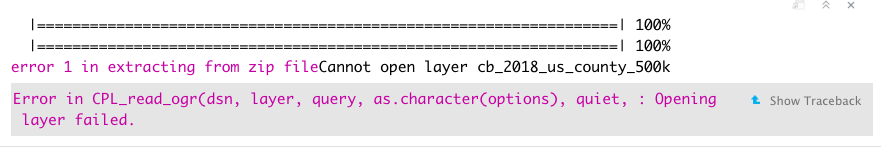
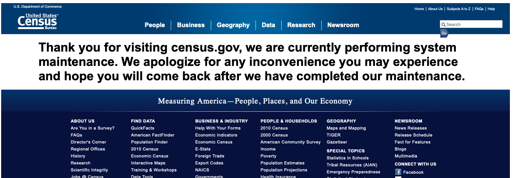

# Census Data Wrangling {#contextual-data}

## Overview {#CD-research-question}

Once we identify the appropriate access metric to use, we can now include contextual data to add nuance to our findings. This can help identify if any specific disparities in access exist for certain groups of people or if there are any specific factors that can help explain the spatial patterns. Such datasets are often sourced from the [US Census Bureau](https://data.census.gov). The American Community Survey (ACS) is an ongoing survey that provides data every year with 1 and 5-year estimates. We generally recommend using the 5-year estimates as these multiperiod estimates tend to have increased statistical reliability as compared to the 1-year numbers, especially for less populated areas and small population subgroups.

In this tutorial we demonstrate how to explore and download most commonly used population datasets from the same, with and without spatial components. Please note this tutorial focuses **only** on the American Community Survey datasets available via the Census Bureau API. More details about using tidycensus, with tutorials generated by package authors, can be found [here](https://walker-data.com/tidycensus/).

Our objectives are to:  

* Download census data through the Census API
* Download census boundaries thorough the Census API
* Wrangle, clean and merge data for further integration

## Environment Setup {#CD-setup}

To replicate the codes & functions illustrated in this tutorial, you’ll need to have R and RStudio downloaded and installed on your system. This tutorial assumes some familiarity with the R programming language.

### Input/Output {#CD-i-o}
Our only external input will be the SHP file for Chicago City Boundary to filter the zipcode level data for the City of Chicago, which can be found [here](https://github.com/GeoDaCenter/opioid-environment-toolkit/tree/master/data). Simply downloading the datasets from the [US Census Bureau](https://data.census.gov) website doesn't require any external file input. 

* Chicago City Boundary, `boundaries_chicago.geojson`

Our output will be two sets of files:  

- CSV file and shapefile with Race Data distributions at county level for the state of Illinois. 
- and CSV file and shapefile with Population and Per Capita Income for the zipcodes within the city of Chicago for 2018.

### Load Libraries {#CD-lib}
We will use the following packages in this tutorial:
  
- `sf`: to read/write sf (spatial) objects
- `tidycensus`: to download census variables using ACS API 
- `tidyverse`: to manipulate and clean data
- `tigris` : to download census tiger shapefiles

Load the required libraries.

```{r load,message=FALSE, results='hide', eval = TRUE}
library(sf)
library(tidycensus)
library(tidyverse)
library(tigris)
```

## Enable Census API Key {#CD-api-key}

To be able to use the Census API, we need to signup for an API key. This key effectively is a string identifier for the server to communicate with your machine. A key can be obtained using an email from [here](http://api.census.gov/data/key_signup.html). Once we get the key, we can install it by running the code below.

```{r setup key, eval = FALSE}
#census_api_key("yourkeyhere", install = TRUE) # installs the key for future sessions. 
```

In instances where we might not want to save our key in the .Renviron - for example, when using a shared computer, we can always reinstall the same key using the code above but with `install = FALSE`.

To check an already installed census API key, run
```{r check key, eval = FALSE}
Sys.getenv("CENSUS_API_KEY")
```

## Load Data Dynamically {#CD-get-data}

We can now start using the *tidycensus* package to download population based datasets from the US Census Bureau. In this tutorial, we will be covering methods to download data at the state, county, zip and census tract levels. We will also be covering methods to download the data with and without the geometry feature of the geographic entities. 

To download a particular variable or table using tidycensus, we need the relevant variable ID, which one can check by reviewing the variables available via `load_variables()` function. For details on exploring the variables available via the *tidycensus* & to get their identifiers, check the [Explore variables available](#CD-explore-variables) section in Appendix.

We can now download the variables using `get_acs()` function. Given ACS data is based of an annual sample, the datapoints are available as an estimate with a margin or error (moe). The package provides both values for any requested variable in the **tidy** format.

For the examples covered in this tutorial, the 4 main inputs for `get_acs()` function are: 

a. `geography` - for what scale to source the data for *(state / county / tract / zcta)*
b. `variables` - character string or a vector of character strings of variable IDs to source
c. `year`      - the year to source the data for
d. `geometry`  - whether or not to include the geometry feature in the tibble. *(TRUE / FALSE)*


### State Level {}
To get data for only a specific state, we can add `state = sampleStateName`.
```{r download state level, message = FALSE, eval = TRUE}
stateDf <- get_acs(geography = 'state', variables = c(totPop18 = "B01001_001", 
                                                      hispanic ="B03003_003", 
                                                      notHispanic = "B03003_002",
                                                      white = "B02001_002", 
                                                      afrAm = "B02001_003", 
                                                      asian = "B02001_005"),
                   year = 2018, geometry = FALSE) 
head(stateDf)
```


As we can see the data is available in the _tidy_ format. We can use other tools in the `tidyverse` universe to clean and manipulate it. 


```{r reshape data, eval = TRUE}
stateDf <- stateDf %>% 
            select(GEOID, NAME, variable, estimate) %>% 
            spread(variable, estimate) %>% 
            mutate(hispPr18  = hispanic/totPop18, whitePr18 = white/totPop18,
                   afrAmPr18 = afrAm/totPop18, asianPr18 = asian/totPop18) %>%
            select(GEOID,totPop18,hispPr18,whitePr18,afrAmPr18, asianPr18)

head(stateDf)
```

### County Level {}
Similarly, for county level 

+ use `geometry = county` to download for all counties in the U.S.
+ use `geometry = county, state = sampleStateName` for all counties within a state
+ use `geometry = county, state = sampleStateName, county = sampleCountyName` for a specific county


```{r download county level, message = FALSE, eval = TRUE}
countyDf <- get_acs(geography = 'county', variables = c(totPop18 = "B01001_001", 
                                                        hispanic ="B03003_003", 
                                                        notHispanic = "B03003_002",
                                                        white = "B02001_002", 
                                                        afrAm = "B02001_003", 
                                                        asian = "B02001_005"), 
                    year = 2018, state = 'IL', geometry = FALSE) %>% 
            select(GEOID, NAME, variable, estimate) %>% 
            spread(variable, estimate) %>% 
            mutate(hispPr18  = hispanic/totPop18, whitePr18 = white/totPop18,
                   afrAmPr18 = afrAm/totPop18, asianPr18 = asian/totPop18) %>%
            select(GEOID,totPop18,hispPr18,whitePr18,afrAmPr18, asianPr18)

head(countyDf)
```


### Census Tract Level {}
For census tract level, at the minimum *stateName* needs to be provided. 

+ use `geometry = tract, state = sampleStateName` to download all tracts within a state
+ use `geometry = tract, state = sampleStateName, county = sampleCountyName` to download all tracts within a specific county

```{r download tract level, message = FALSE, results='hide', eval = TRUE}
tractDf <- get_acs(geography = 'tract',variables = c(totPop18 = "B01001_001", 
                                                   hispanic ="B03003_003", 
                                                   notHispanic = "B03003_002",
                                                   white = "B02001_002", 
                                                   afrAm = "B02001_003", 
                                                   asian = "B02001_005"), 
                    year = 2018, state = 'IL', geometry = FALSE) %>% 
            select(GEOID, NAME, variable, estimate) %>% 
            spread(variable, estimate) %>% 
            mutate(hispPr18  = hispanic/totPop18, whitePr18 = white/totPop18, 
                   afrAmPr18 = afrAm/totPop18, asianPr18 = asian/totPop18) %>%
            select(GEOID,totPop18,hispPr18,whitePr18,afrAmPr18, asianPr18)

head(tractDf)
```

### Zipcode Level {}
For zipcode level, use `geometry = zcta`. Given zips cross county/state lines, zcta data is only available for the entire U.S.
```{r download zip level, message = FALSE, eval = TRUE}
zctaDf <- get_acs(geography = 'zcta',variables = c(totPop18 = "B01001_001", 
                                                   hispanic ="B03003_003", 
                                                   notHispanic = "B03003_002",
                                                   white = "B02001_002", 
                                                   afrAm = "B02001_003", 
                                                   asian = "B02001_005"), 
                    year = 2018, geometry = FALSE) %>% 
            select(GEOID, NAME, variable, estimate) %>% 
            spread(variable, estimate) %>% 
            mutate(hispPr18  = hispanic/totPop18, whitePr18 = white/totPop18, 
                   afrAmPr18 = afrAm/totPop18, asianPr18 = asian/totPop18) %>%
            select(GEOID,totPop18,hispPr18,whitePr18,afrAmPr18, asianPr18)
```

Inspect the data. 
```{r eval = TRUE}
head(zctaDf)
dim(zctaDf)
```

Given zipcode data can only be sourced for the entire nation, after sourcing it, we can filter them for certain region,e.g. below we can filter for zipcodes in Chicago by using `str_detect`. If we had the geometry information, we could overlay the zipcode geometry with the desired shape boundary to easily filter the required region. We will illustrate that in the [Get Geometry](#CD-get-geometry) section.

```{r eval = TRUE}
zipChicagoDf <- get_acs(geography = 'zcta', variables = c(perCapInc = "DP03_0088"),year = 2018, geometry = FALSE) %>%
                  select(GEOID, NAME, variable, estimate) %>% 
                  filter(str_detect( GEOID,"^606")) %>%  ## add a str filter
                  spread(variable, estimate) %>% 
                  select(GEOID, perCapInc)
```

### Save Data {}

And now we can save the county and zipcode datasets in CSV file using the code below.

```{r save csv data, message = FALSE, results='hide', eval = TRUE}
write.csv(countyDf, "data/ilcounty_18_race.csv")
write.csv(zipChicagoDf , file = "data/chizips_18_pci.csv")
```


For more details on the other geographies available via the *tidycensus package*, check [here](https://walker-data.com/tidycensus/articles/basic-usage.html#geography-in-tidycensus-1).

## Get Geometry {#CD-get-geometry}

Geometry/Geographic Boundaries are one of the key features for American Community Survey Data as they set up the framework for data collection and estimation. While boundaries don't change often, updates do occur from time to time and census data for a specific year generally tends to use the boundaries available at the beginning of that year. Most ACS products since 2010 reflect the 2010 Census Geographic Definitions. Given certain boundaries like congressional districts, census tracts & block groups are updated after every decennial census, products for year 2009 and earlier will have significantly different boundaries from that in 2010. We recommend using IPUMS datasets to generate estimates for years prior to 2010. 

The datasets downloaded so far did not have a spatial geometry feature attached to them. To run any spatial analysis on the race data above, we would need to join these dataframes to another spatially-enabled `sf` object. We can do so by joining on the 'GEOID' or any other identifier. We can download the geometry information using two methods : 

1. using `tigris` 
2. using `tidycensus`

### Using tigris {}
To download and use the Tiger Shapefiles shared by the [US Census Bureau](https://www.census.gov/geographies/mapping-files/time-series/geo/tiger-line-file.html) we will use the `tigris` package. Set `cb = TRUE` to get generalized files, these don't have high resolution details and hence are smaller in size. 

```{r download shapefiles, message = FALSE, results = 'hide', eval = TRUE}
yearToFetch <- 2018

stateShp <- states(year = yearToFetch, cb = TRUE)
countyShp <- counties(year = yearToFetch, state = 'IL', cb = TRUE)
tractShp <- tracts(state = 'IL',year = yearToFetch, cb = TRUE) 
zctaShp <- zctas(year = yearToFetch, cb = TRUE) 
```


Sometimes the ACS FTP might be down for system maintenance or some other reason, and in such a scenario the code returns an error message like below. You can check the website status from [here](https://www2.census.gov/geo/tiger/TIGER2019/) to confirm. If the website is truly down, we recommend trying the download again in a few hours.

```{r, echo=F, fig.align="center", fig.cap="R error message"}

```

```{r, echo=F, fig.align="center", fig.cap="ACS website outage message"}

```

After we have successfully download the geometry files, we can now merge these shapes with the race data downloaded in previous section. 

For states:
```{r merge with state Census Data, eval = TRUE}
# check object types & identifier variable type
# str(stateShp)
# str(stateDf) 
stateShp <- merge(stateShp, stateDf, by.x  = 'STATEFP', by.y = 'GEOID', all.x = TRUE)
head(stateShp)

```

Similarly for counties, zctas & census tracts we can use the code below.

```{r merge with Census shapefiles,  message = FALSE, eval = TRUE}
countyShp <- merge(countyShp, countyDf, by.x  = 'GEOID', by.y = 'GEOID', all.x = TRUE) %>%
                select(GEOID,totPop18,hispPr18,whitePr18,afrAmPr18, asianPr18)

tractShp <- merge(tractShp, tractDf, by.x  = 'GEOID', by.y = 'GEOID', all.x = TRUE) %>%
              select(GEOID,totPop18,hispPr18,whitePr18,afrAmPr18, asianPr18)

zctaShp <- merge(zctaShp, zctaDf, by.x  = 'GEOID10', by.y = 'GEOID', all.x = TRUE)%>%
              select(GEOID10,totPop18,hispPr18,whitePr18,afrAmPr18, asianPr18)

```

### Using tidycensus {}

The previous method adds an additional step of using `tigris` package to download the shapefile.
The tidycensus package already has the wrapper for invoking tigris within the `get_acs()` function, and we can simply download the dataset with geometry feature by using `geometry = TRUE`. 

The wrapper adds the geometry information to each variable sourced, and the file size can become large in the intermediary steps and slow down the performance, even though the data is in tidy format. So if you are looking to download many variables with large API requests, we  recommend downloading the dataset without geometry information and then downloading a nominal variable like total population or per capita income with get geometry using `get_acs()` or simply using the `tigris` method, as covered in previous section & then implementing a merge. We have illustrated both methods below.

```{r tract level using tidycensus,  message = FALSE, eval = TRUE}
tractDf <- get_acs(geography = 'tract', variables = c(totPop18 = "B01001_001", 
                                                      hispanic ="B03003_003", 
                                                      notHispanic = "B03003_002",
                                                      white = "B02001_002", 
                                                      afrAm = "B02001_003", 
                                                      asian = "B02001_005"), 
                   year = 2018, state  = 'IL', geometry = FALSE) %>%
            select(GEOID, NAME, variable, estimate) %>% 
            spread(variable, estimate) %>% 
            mutate(hispPr18  = hispanic/totPop18, whitePr18 = white/totPop18,
                   afrAmPr18 = afrAm/totPop18, asianPr18 = asian/totPop18) %>%
            select(GEOID,totPop18,hispPr18,whitePr18,afrAmPr18, asianPr18)

tractShp <- get_acs(geography = 'tract', variables = c(perCapitaIncome = "DP03_0088"),
                    year = 2018, state  = 'IL', geometry = TRUE) %>% 
            select(GEOID, NAME, variable, estimate) %>% 
            spread(variable, estimate)
                

tractsShp <- merge(tractShp, tractDf, by.x = 'GEOID', by.y = 'GEOID', all.x = TRUE)
head(tractShp)
```

To get zipcode level data for a specific region, we first need to download the required dataset for the entire country and then we can filter the relevant zipcodes by overlaying the downloaded dataset with the geometry feature of that region. For example, to get data only for Chicago, we can overlay the city boundaries over the zcta file(with geometry) using the `st_intersection` function as shown below.

```{r zip level using tidycensus,  message = FALSE, eval = TRUE}
zctaShp <- get_acs(geography = 'zcta', variables = c(totPop18 = "B01001_001",
                                                           perCapInc = "DP03_0088"), 
                         year = 2018, geometry = TRUE) %>%
                  select(GEOID, NAME, variable, estimate) %>% 
                  spread(variable, estimate) %>% 
                  rename(totPop18 = B01001_001, perCapitaInc = DP03_0088) %>%
                  select(GEOID,totPop18,perCapitaInc)
head(zctaShp)

# read in the city boundary file
chiCityBoundary <- st_read("data/boundaries_chicago.geojson") 

# set same CRS for both shapefiles
chiCityBoundary <- st_transform(chiCityBoundary, 4326) 
zctaShp <- st_transform(zctaShp, 4326)

#only keep those zipcodes that intersect the Chicago city boundary
zipChicagoShp <- st_intersection(zctaShp,chiCityBoundary)
head(zipChicagoShp)
```

### Save Data {}

We previously saved our files without geometry information as CSVs. Now we can save the census tract race data and Chicago zipcode level per capita income with geometries as shapefiles using `write_sf`.

```{r eval = TRUE}
write_sf(countyShp, "data/ilcounty_18_race.shp")
write_sf(zipChicagoShp, "data/chizips_18_pci.shp")
```


## Appendix {#CD-appendix}

### Explore variables {#CD-explore-variables}
Using `tidycensus` we can download datasets from various types of tables. The ones most commonly used are:

1. *Data Profiles* - These are the most commonly used collection of variables grouped by category, e.g. Social (DP02), Economic (DP03), Housing (DP04), Demographic (DP05)
2. *Subject Profiles*  - These generally have more detailed information variables (than DP) grouped by category, e.g. Age & Sex (S0101), Disability Characteristics (S1810)
3. The package also allows access to a suite of B & C tables. 

We can explore all the variables for our year of interest by running the code below. Please note as the Profiles evolve, variable IDs might change from year to year. 

```{r check variables,  message = FALSE, eval = TRUE}
sVarNames <- load_variables(2018, "acs5/subject", cache = TRUE)
pVarNames <- load_variables(2018, "acs5/profile", cache = TRUE)
otherVarNames <- load_variables(2018, "acs5", cache = TRUE)

head(pVarNames)
```

A tibble with table & variable information has three columns : *name, label, concept*. 

Name is a combination of table id and variable id within that table. Concept generally identifies the table name or grouping used to arrange variables. Label provides textual details about the variable.

We can explore these tibbles to identify the correct variable ID `name` to use with the `get_acs()` function by using `View(sVarNames)` or other filters e.g. for age

```{r explore variables 1 ,  message = FALSE, eval = TRUE}

sVarNames %>% filter(str_detect(concept, "AGE AND SEX")) %>%  # search for this concept
              filter(str_detect(label, "Under 5 years")) %>%  # search for variables
              mutate(label = sub('^Estimate!!', '', label)) %>% # remove unnecessary text
              select(variableId = name, label) # drop unnecessary columns and rename

sVarNames %>% filter(str_sub(name, 1, 5) == "S0101") %>%  # search for these tables
              filter(str_detect(label, "Under 5 years")) %>%  # search for variables
              mutate(label = sub('^Estimate!!', '', label)) %>% # remove unnecessary text
              select(variableId = name, label) # drop unnecessary columns and rename
```

e.g per capita income, we can check on DP table variables.

```{r explore variables 2,  message = FALSE, eval = TRUE}

pVarNames %>% filter(str_detect(label, "Per capita")) %>%  # search for variables
              mutate(label = sub('^Estimate!!', '', label)) %>% # remove unnecessary text
              select(variable = name, label) # drop unnecessary columns and rename

pVarNames %>% filter(str_detect(label, "Under 5 years")) %>%  # search for variables
              mutate(label = sub('^Estimate!!', '', label)) %>% # remove unnecessary text
              select(variable = name, label) # drop unnecessary columns and rename
```

The order and structure of profile tables can change from year to year, hence the variable Id or label, so when downloading same dataset over different years we recommend using the standard B & C tables.

```{r explore variables 3, eval = TRUE}

otherVarNames %>% filter(str_detect(label, "Per capita")) %>%  # search for variables
              mutate(label = sub('^Estimate!!', '', label)) %>% # remove unnecessary text
              select(variable = name, label) # drop unnecessary columns and rename

```
