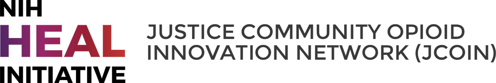

# Introduction {-}

This toolkit provides an **introduction to GIS and spatial analysis** for opioid environment applications that will allow researchers, analysts, and practitioners to support their communities with better data analytics and visualization services. 

We introduce basic spatial analytic functionalities using **open source tools**, mainly in R, using applied examples for visualizing, mapping, and understanding the opioid risk environment. 

## Software Basics {-}

We assume a basic knowledge of R and coding languages for these toolkits. For most of the tutorials in this toolkit, you’ll need to have R and RStudio downloaded and installed on your system. You should be able to install packages, know how to find the address to a folder on your computer system, and have very basic familiarity with R. If you are new to R, we recommend the following <a href="https://learn.datacamp.com/courses/free-introduction-to-r">intro-level tutorials</a> provided through <a href="https://rspatial.org/intr/1-introduction.html">installation guides</a>. You can also refer to this <a href="https://datacarpentry.org/r-socialsci/">R for Social Scientists</a> tutorial developed by Data Carpentry for a refresher.

We will work with following libraries, so please be sure to install: 

* sf 
* tmap
* tidyverse
* tidycensus

There are differing spatial ecosystems in R. We use the `sf` ecosystem that is compatible with the `tidyverse`. If you need to work between these two R spatial ecosystems, see [this guide](https://github.com/r-spatial/sf/wiki/Migrating) for a translation of `sp` to `sf` commands.    

## Author Team {-}

This toolkit was developed for the [JCOIN network](https://heal.nih.gov/research/research-to-practice/jcoin) by Marynia Kolak, Moksha Menghaney, Qinyun Lin, and Angela Li at the <a href="https://spatial.uchicago.edu/">Center for Spatial Data Science</a> at the University of Chicago as part of the Methodology and Advanced Analytics Resource Center (MAARC). 

JCOIN is part of the of the NIH HEAL Initiative. The Helping to End Addiction Long-term Initiative<sup>SM</sup>, or NIH HEAL Initiative<sup>SM</sup>, supports a wide range of programs to develop new or improved prevention and treatment strategies for opioid addiction.

***

```{r, echo=F}

```


```{r setup, include=FALSE}
knitr::opts_chunk$set(echo = TRUE)
options(tigris_use_cache = TRUE)
```