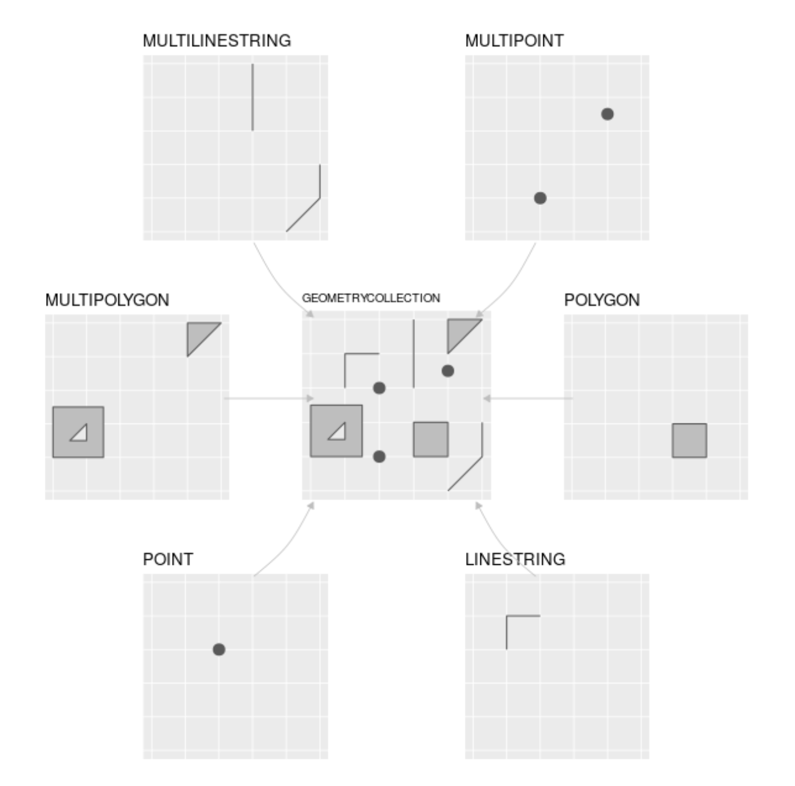
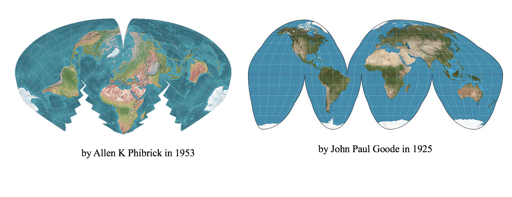

# Spatial Data Introduction

## Defining spatial data  {#SD-spatial-data}
Spatial data refers to data that contain information about specific locations, and the information content of the data may change with location. In other words, "information" and "location" are two important elements in spatial data. On some occasions, spatial data may only include "location." But without "location," the data is no longer spatial anymore. For example, a spatial data that describes the resource distribution of Medications for Opioid Overuse Disorder (MOUDs) must contain *and enable* location information of these MOUD resources, otherwise the data becomes a non-spatial list of those resources.

For the purpose of this tutorial, we will only briefly introduce some important concepts in spatial data. See *Further Resources* if you would like to learn more about these concepts. 

## Spatial data formats {#SD-vector-data}
Spatial data can be stored in a text file like comma-separated value (CSV) files. However, the text file needs to have essential location columns with latitude and longitude to represent the coordinate location of a spatial object. Furthermore, a CSV file with lat/long columns is only a flat/non-spatial file, until the spatial location context is enabled as a new spatial data format.

A common spatial data format is the shapefile, which comes from ESRI/ArcGIS proprietary software. The shapefile file format (.shp for short) includes a minimum of 4 files, with a common prefix and different filename extensions `.shp`, `.shx`, `.dbf`, and `.prj`. In order to work with the spatial data, we need all these four components of the shapefile stored in the same directory, so that the software (such as R) can know how to project spatial objects onto a geographic or coordinate space (i.e., spatial location context is enabled). Other common spatial data formats include the GeoJSON, KML, and geopackage.

### Simple features

[Simple features](https://r-spatial.github.io/sf/articles/sf1.html) refers to an international standard (ISO 19125-1:2004) that describes how real-world objects, and their spatial geometries, are represented in computers. This standard is enabled in ESRI/ArcGIS architecture, POSTGIS (a spatial extension for PostGresSQL), the GDAL libraries that serve as underpinnings to most GIS work, and GeoJSONs. The `sf` R ecoystem makes simple features even more accessible within R, so that simple feature objects in spatial data are also stored in a data frame, with one vector/column containing geographic data (usually named "geometry" or "geom"). 

Why should you care about these computational components of spatial systems architecture? Spatial analysis often requires troubleshooting, and spatial formats can be complicated. 

We recommend using the `str` function in R to familiarize yourself with data objects as you go, and to explore the data files as well. For example: a `shapefile` includes (at least) four components, separating the data as a .dbf file and projection information as a .prj file. In contrast, the `sf` spatial file loaded in your R environment is one unified object, has the spatial information recorded as a geometry field, and projection stored as metadata. 

## Spatial data types

Two common formats of spatial data are vector and raster data. For the purpose of this tutorial, we will focus on vector data that represents the world surface using points, lines, and polygons. Connecting points can generate lines, and connecting lines that crate an enclosed area can generate polygons. The figure below shows 7 commonly used geometry types based on points, lines, and polygons. For our purposes, think of further simplifying these to points, lines, and polygons. A group of clinics can be geocoded and converted to points, whereas zip code boudnaries are represented as polygons.  

```{r, echo=F}

```

The figure above is from [Chapter 2 Geographic data in R](https://geocompr.robinlovelace.net/spatial-class.html#intro-sf) of the Lovelace et al 2019 text, [Geocomputation with R](https://geocompr.robinlovelace.net/). This opensource text is an incredible resource for those who are interested in learning more details regarding geographic data analysis, visualization, and modeling, and represents one of dozens of resources available for learning and honing R & spatial analysis skills.

## Coordinate Reference System {#SD-crs}
As noted before, the most fundamental element of a spatial data is "location." A **Coordinate Reference System (CRS)** communicates what method should be used to flatten or project the Earth's surface onto a 2-dimensional map.

Importantly, different CRS implies different ways of projections and generates substantially different visualizations. For example, following are two world maps using different projections. (Check out [here](https://futuremaps.com/blogs/news/top-10-world-map-projections) for more different world map projections!)

```{r, echo=F}

```

Because different CRS imply different ways of projections and generates substantially different visualizations, it is important to make sure the CRS accompanied with each spatial data are the same before implementing any advanced spatial analysis or geometric processing. In `sf`, you can use the function `st_crs` to check the CRS used in one data, and the function `st_transform` to project the data to a particular CRS. See this [Interactive Tutorial](https://spatialanalysis.github.io/workshop-notes/introduction-to-spatial-data.html#interactive-tutorial) that demonstrates these functions.  

The CRS concept can be tricky to comprehend and utilize in practice, so we will come back to this several times in our tutorials. 

## Further resources {-#SD-appendix}
* See [Chapter 2 Geographic data in R in Geocomputation with R](https://geocompr.robinlovelace.net/spatial-class.html) for more info about [Vector data](https://geocompr.robinlovelace.net/spatial-class.html#vector-data), [Raster data](https://geocompr.robinlovelace.net/spatial-class.html#raster-data), and [Coordiante Reference Systems](https://geocompr.robinlovelace.net/spatial-class.html#raster-data). 
* See this [Software Carpentry workshop](https://datacarpentry.org/organization-geospatial/03-crs/index.html) for more explanations to better understand coordinate reference systems. 
* See this [Interactive Tutorial](https://spatialanalysis.github.io/workshop-notes/introduction-to-spatial-data.html#interactive-tutorial) that uses `sf` package to project spatial data in R.  


